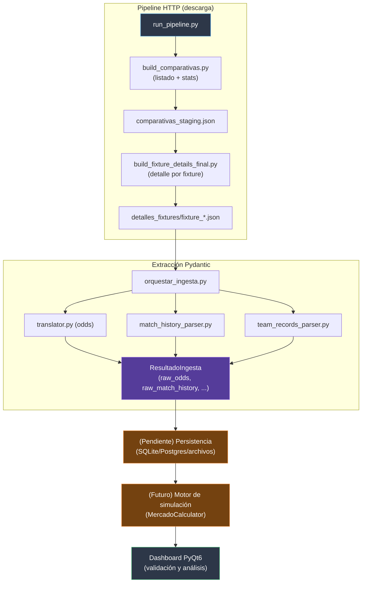

# Beet

Modelo de predicción y detección de apuestas de valor.

## Visión

Beet predice partidos de fútbol mediante simulación (no una fórmula cerrada de probabilidad): a partir de datos históricos y contexto del partido se simula el resultado, y de esa simulación surgen las probabilidades por mercado (1X2, doble oportunidad, DNB, goles, BTTS, corners). Esas probabilidades se comparan luego contra la cuota de la casa de apuestas para detectar value bets.

La fuente principal de datos es **Adam Choi** (`adamchoi.co.uk` + `api.choistats.com`), obtenida mediante un **pipeline HTTP automatizado** (sin necesidad de capturas de pantalla ni PDFs). Los datos se descargan en crudo (JSON) y se procesan con modelos Pydantic para extraer:
- `raw_odds`: cuotas por mercado y bookmaker.
- `raw_match_history`: historial partido a partido (goles, corners, tarjetas, tiros, etc.).
- `team_records`: posición y récords de los equipos en la liga.

El pipeline de ingesta está **completamente validado** contra fixtures reales (Premiership escocesa, Liga Pro Ecuador, Bundesliga austriaca). Lo que queda es conectar la persistencia (SQLite/Postgres/archivos) y la integración con el paquete `beet/` y el motor de simulación.

El objetivo no es solo "encontrar cuotas mal calibradas" — es que la predicción en sí sea lo más precisa posible, y que el valor esperado surja de ahí. Cada predicción se puede verificar después contra el resultado real, y esa verificación retroalimenta el propio modelo (backtesting → calibración empírica → mejores predicciones).

Aunque hoy es una herramienta de análisis, la meta de fondo es que llegue a ser lo bastante confiable como para usarse con apuestas reales.

## Alcance

### Lo que Beet hace

- **Ingesta HTTP automatizada desde Adam Choi**: un pipeline de dos pasos (listado de fixtures + detalle por partido) descarga JSON con odds, historial y registros de equipos. El cache-buster (`v`) se obtiene automáticamente con Playwright y se cachea en disco para no repetir navegadores.
- **Extracción a modelos Pydantic**: los JSON crudos se transforman en modelos tipados:
  - `RawOdds`: cada outcome de cada mercado (con validación de cuota > 1.0).
  - `RawMatchHistory`: partidos históricos con todos los campos relevantes (goles, corners, tarjetas, tiros, etc.).
  - `FixtureMatchHistoryRef`: relación fixture ↔ partido histórico (con `result`/`htResult` desde la perspectiva del equipo de referencia).
  - `TeamRecordSummary` y `TeamStandingsRow`: posición y estadísticas de los equipos.
  - `ValidationErrors`: cola de errores de validación para revisión manual.
- **Traducción de mercados**: los outcomes crudos se traducen a pares (lado, línea) mediante `market_registry.py` (con estrategias declarativas por mercado) y `special_markets.py` (Double Chance y HT/FT). Selección de bookmaker por prioridad (BET365 > SPORTMONKSBET365 > UNIBET).
- **Validación aislada por registro**: un outcome corrupto no detiene el procesamiento del resto del fixture; los errores se registran en `ValidationErrors` para reproceso manual.
- **Datos persistentes**: (pendiente de implementar) guarda los resultados en un backend a definir (SQLite/Postgres/archivos) para reutilización y backtesting.
- **Modelado de dominio**: representa partidos, historiales de equipos, cuotas y mercados como objetos Python tipados (Pydantic).
- **Visualización**: dashboard PyQt6 para validar que los parsers extraen correctamente (usando Gemini para PDFs, aunque el pipeline HTTP es ahora la fuente principal).
- **Backtesting**: (futuro) comparar predicciones vs resultados reales para calibrar el modelo.

### Lo que Beet NO hace (por ahora)

- No coloca apuestas automáticamente ni se conecta a casas de apuestas.
- No es un tipster — comunica probabilidad y valor esperado, no certezas.
- No cubre todos los deportes — foco actual: fútbol.

## Estado actual 02/08/26

**Arquitectura de ingesta completa (descarga HTTP + extracción Pydantic) validada contra datos reales.**  
El pipeline de descarga (`run_pipeline.py` + `build_comparativas.py` + `build_fixture_details_final.py` + `obtener_v.py`) obtiene JSON de fixtures desde Adam Choi. La capa de extracción (`orquestar_ingesta.py` + `ingestion_models.py` + `translator.py` + `market_registry.py` + `match_history_parser.py` + `team_records_parser.py`) transforma esos JSON en modelos Pydantic. **Todo corre en scripts standalone**; falta la persistencia (backend) y la integración con el paquete `beet/` y el motor de simulación.

### Cambios recientes (v3.0)

- **Migración de OCR local a Google Gemini**: se eliminó Tesseract, OpenCV y pdfplumber. Ahora se usa `gemini-3.1-flash-lite` para visión y PDFs.
- **Pool de 2 API Keys**: procesamiento en paralelo con round-robin para evitar rate limits.
- **Doble imagen procesada**: se extraen tanto los goles (Match Result) como los corners (Total Match Corners) de cada partido.
- **Datos persistentes**: módulo `beet/data/` guarda resultados en `beet/data/partidos/*.json` para reutilización y backtesting.
- **Indicador visual**: los partidos ya procesados se muestran con "✓" verde en la lista.
- **Fix de Unicode**: workaround para rutas con tildes/ñ en Windows.
- **Escaneo automático**: al cargar una carpeta, se procesan todos los partidos en background automáticamente.

### Cambios recientes (v3.1)

- **API Keys ya no están hardcodeadas**: se migraron a `~/.beet/config.json`, fuera del repo. Al arrancar la app por primera vez (o si el archivo de config no existe), un diálogo (`beet/ui/widgets/api_keys_dialog.py`) pide 1 o 2 keys de Gemini y las guarda. Las keys se leen de forma perezosa (recién al pedir el primer cliente, no al importar el módulo), para que el diálogo pueda guardarlas antes de que cualquier parser las necesite.
- **Módulo compartido `_gemini_common.py`**: se deduplicó la lógica repetida entre `imagen.py` y `pdf.py` (rotación de clientes, subida de archivos temporales, extracción de JSON, reintentos con backoff).
- **Reintentos en el parser de PDF**: `pdf.py` no tenía la lógica de reintentos ante rate limit/cuota que sí tenía `imagen.py` — ahora ambos la comparten.
- **Fix de crash fatal en `visor_controller.py`**: los workers se identificaban con `id(worker)`, pero al ser `QRunnable` con auto-eliminación, Python podía reutilizar esa misma dirección de memoria para el siguiente worker creado, causando colisiones y un `KeyError` que escapaba de un slot de Qt y crasheaba la app a nivel de sistema operativo. Ahora se usa un contador incremental único (`itertools.count()`).
- **Fix de resultados cruzados en la UI**: el auto-escaneo procesa todos los partidos en background; antes, el resultado de cualquier partido que terminara de procesarse pisaba lo que el usuario tenía abierto en pantalla, sin importar cuál estuviera seleccionado. Las señales del controller ahora llevan la clave del partido, y la ventana principal descarta los resultados que no correspondan al partido seleccionado.
- **Fix de columna "Casa" vacía en la tab de Cuotas**: leía un atributo `casa` que no existe en el modelo `Cuota` (el campo real es `casa_origen`).

### Pipeline de ingesta HTTP y extracción Pydantic (nuevo, completado)

**Parte 1: Descarga automática desde Adam Choi**  
Scripts standalone (fuera del paquete `beet/`):
- `obtener_v.py`: obtiene el cache-buster `v` fresco abriendo la página con Playwright headless y capturando la request real. Cache en disco (`.v_cache.json`) para no lanzar navegador en cada corrida.
- `build_comparativas.py`: descarga el listado de fixtures con stats agregadas (filtra copas y ligas Premium por defecto). Usa `v` cacheado; si recibe 401, refresca el cache y reintenta.
- `build_fixture_details_final.py`: descarga detalle por fixture (3 endpoints: `odds`, `team-records`, `recent-results`) y guarda un JSON por `external_id`. **Ya no pide `chances` ni `comparison_stats`** (eran agregados recalculables desde `recent_results` y outputs opacos del proveedor).
- `run_pipeline.py`: orquestador único que ejecuta ambos en secuencia. Soporta filtros por fecha (`--hoy`, `--manana`, `--semana`, `--desde/--hasta`) y límite de fixtures.
- `ver_partidos.py`: visor de consola del staging (agrupa por día/país/liga).

**Parte 2: Extracción a modelos Pydantic**  
Scripts standalone (código en `ingestion_models.py`, `translator.py`, `market_registry.py`, `special_markets.py`, `bookmaker_priority.py`, `match_history_parser.py`, `team_records_parser.py`):
- `orquestar_ingesta.py`: orquestador que toma un JSON de fixture (generado por la parte 1) y produce un `ResultadoIngesta` con todas las filas RAW (`raw_odds`, `raw_match_history`, `fixture_match_history_refs`, `team_records`). **Validado end-to-end contra `fixture_19664045.json` (Emelec vs Aucas) y `fixture_19722821.json` (Aberdeen vs Hearts): 0 errores de validación.**
- **Modelos Pydantic**:
  - `RawOdds`: valida `decimal_odds > 1.0`; `external_bet_id` es `Optional` (SPORTMONKSBET365 no lo reporta).
  - `RawMatchHistory`: un único modelo para los 5 orígenes de `recent_results` (con `corners_1h/2h` como `Optional` porque su disponibilidad depende de la liga). **No incluye `result`/`ht_result`** — esos son relativos al fixture que consulta, no propiedad del partido histórico.
  - `FixtureMatchHistoryRef`: relación fixture↔partido histórico con `result`/`ht_result` (perspectiva del equipo de referencia) y `source_block`.
  - `TeamRecordSummary` y `TeamStandingsRow`: registros de posición y tabla de posiciones. **Sanitización de leakage**: se descartan entradas de `homeResults`/`awayResults` con fecha igual o posterior a la del fixture actual (mismo riesgo que en `recent_results`).
  - `ValidationErrors`: cola de errores con `status` (`pending`/`reviewed`) para reproceso manual.
- **Traducción de mercados**:
  - `market_registry.py`: diccionario que mapea `market_name` a una estrategia declarativa (`side_source`, `line_source`) para extraer lado y línea de cada outcome. Soporta 19 mercados whitelist (incluyendo la excepción de `Total shots on target` donde la línea solo está en `outcomeName`).
  - `special_markets.py`: mapeos fijos para `Double Chance` (3 combinaciones) y `Half Time/Full Time` (9 combinaciones).
  - `bookmaker_priority.py`: selección de bookmaker con orden `BET365 > SPORTMONKSBET365 > UNIBET`.
  - `translator.py`: `parsear_raw_odds_desde_json()` construye `list[RawOdds]` desde el JSON crudo; `traducir_fixture()` agrupa por `(market_name, outcome_key)` entre bookmakers, aplica prioridad y traduce con el registry.

**Lo que falta:**
- **Persistencia**: hoy todo corre en memoria. Hay un stub `persistir()` en `orquestar_ingesta.py` que lanza `NotImplementedError`. Falta decidir backend (SQLite/Postgres/archivos) y conectarlo.
- **Integración con el paquete `beet/`**: mover los scripts y modelos al paquete principal (ej. `beet/ingest/adamchoi_http/`) y que el visor los consuma.
- **Motor de simulación**: una vez que los datos estén persistidos, implementar los `MercadoCalculator` que consuman `Comparativa`/`Pronostico` para generar predicciones.

## Instalación

```bash
# 1. Clonar el repo
git clone https://github.com/NotName-K/Beet.git
cd Beet

# 2. Crear entorno virtual (recomendado)
python -m venv venv
# Windows:
venv\Scripts\activate

# 3. Instalar el paquete en modo editable
pip install -e ".[dev]"

# 4. Instalar dependencias del pipeline HTTP (opcional, si usas la ingesta)
pip install requests playwright curl_cffi  # curl_cffi ya no es necesario para los endpoints actuales, pero se deja por si acaso
playwright install chromium
```

**API Keys de Gemini**: no van en el código. La primera vez que corras la app (`python beet-visor.py` o `python -m beet.ui`), si no existe `~/.beet/config.json` se abre un diálogo pidiendo 1 o 2 keys de Gemini (la segunda es opcional, se usa en rotación para repartir cuota). Quedan guardadas ahí, fuera del repo, y no hace falta volver a ingresarlas en corridas futuras. Si preferís configurarlas a mano, podés crear el archivo vos mismo:

```json
{
  "gemini_api_keys": ["tu-key-1", "tu-key-2"]
}
```

## Ejecución

| Forma | Comando / Acción |
| --- | --- |
| Desarrollo (visor) | `python beet-visor.py` |
| Como módulo | `python -m beet.ui` |
| Instalado | `beet-visor` |
| Windows (sin CMD) | Doble clic en `beet-visor.bat` |
| Pipeline HTTP (descarga) | `python run_pipeline.py --stats BTTS --hoy` |
| Pipeline HTTP (extracción) | `python orquestar_ingesta.py fixture_<id>.json` (aún sin persistencia) |

## Estructura del proyecto

> ⚠️ **Nota sobre rutas**: los datos persistentes NO están en una carpeta `data/` a nivel de repo — viven en `beet/data/` (dentro del paquete Python). Es decir, la ruta completa es `beet/beet/data/partidos/` si estás parado en el directorio padre del repo clonado.

```
Beet/                          ← repo Git (raíz del clone)
 │
 ├── beet-visor.py              ← Entry point standalone
 ├── beet-visor.bat             ← Script Windows
 ├── pyproject.toml             ← Configuración del proyecto
 ├── .gitignore                 ← Archivos ignorados por Git
 ├── README.md                  ← Este archivo
 │
 ├── beet/                      ← Paquete Python principal
 │   ├── core/                  ← Modelos de dominio (Partido, Cuota, Historial)
 │   ├── ingest/                ← Pipeline de ingesta (Gemini, parsers)
 │   ├── ui/                    ← Interfaz gráfica PyQt6
 │   ├── controllers/           ← Orquestador (VisorController)
 │   ├── data/                  ← Datos persistentes (JSON)
 │   ├── services/              ← (Futuro) motor de simulación
 │   └── tests/                 ← Tests unitarios
 │
 └── (scripts standalone del pipeline HTTP y extracción)
     ├── run_pipeline.py
     ├── build_comparativas.py
     ├── build_fixture_details_final.py
     ├── obtener_v.py
     ├── ver_partidos.py
     ├── orquestar_ingesta.py
     ├── ingestion_models.py
     ├── translator.py
     ├── market_registry.py
     ├── special_markets.py
     ├── bookmaker_priority.py
     ├── match_history_parser.py
     └── team_records_parser.py
```

Los scripts standalone están **por fuera del paquete** hasta que se decida su integración formal. La documentación de estos scripts se encuentra en `beet_adamchoi_handoff_v5.md`, `beet_diseno_ingesta_fixtures(2).md`, `beet_sesion_ingesta_estado.md`, `beet_ingesta_estado_v2(1).md` y `CHANGELOG_pipeline.md` (en la raíz del repo, fuera del paquete).

## Flujo de datos



## Decisiones de diseño

### ¿Por qué Google Gemini en vez de OCR local?

- **Precisión superior**: Gemini entiende el layout, los colores (verde=hit, rojo=miss) y las tablas anidadas sin necesidad de preprocesamiento de imágenes ni ROI frágiles.
- **PDF nativo**: lee PDFs directamente, sin depender de pdfplumber que falla con tablas complejas.
- **Costo mínimo**: la capa gratuita de Gemini 3.1 Flash Lite es muy generosa.
- **Trade-off**: requiere conexión a internet y tiene rate limits (mitigado con pool de 2 API Keys).

### ¿Por qué API Keys configurables en vez de hardcodeadas?

- **Nunca deben quedar en git**: hubo un incidente real donde dos keys quedaron commiteadas en `imagen.py`/`pdf.py` y el repo se hizo público con ellas expuestas — se revocaron a tiempo y se limpió el historial con `git filter-repo`, pero el diseño tenía que dejar de depender de eso.
- **Se guardan en `~/.beet/config.json`**, fuera del repo — imposible que un `git push` las vuelva a exponer.
- **Diálogo en el primer arranque**: si el archivo de config no existe, `ApiKeysDialog` las pide antes de crear la ventana principal.
- **Lectura perezosa**: `_gemini_common.py` recién inicializa los clientes de Gemini al pedir el primero, no al importar el módulo — así el orden de imports no importa, el diálogo siempre alcanza a guardarlas antes de que se necesiten.
- **Rotación (round-robin)**: si hay 2 keys, cada una tiene su propio límite de requests por minuto — los workers las toman alternadamente vía `itertools.cycle` + `threading.Lock()` para concurrencia segura. Con 1 sola key también funciona, solo que sin ese margen extra de cuota.

### ¿Por qué datos persistentes en JSON?

- **No gastar tokens**: si ya procesaste un partido, no lo reprocesas.
- **Backtesting futuro**: los datos históricos alimentarán el motor de simulación.
- **Exportable a CSV**: función `exportar_a_csv()` para análisis en Excel/pandas.
- **Legible**: JSON indentado, fácil de inspeccionar y debuggear.

### ¿Por qué PyQt6 y no web?

- Acceso local a archivos sin permisos CORS.
- Sin servidor: no requiere levantar backend ni navegador.
- Rendimiento: QThreadPool permite ejecutar parsers en paralelo sin bloquear UI.
- Empaquetado: se puede compilar a .exe con PyInstaller/Nuitka.

### ¿Por qué dataclasses frozen para el core?

- Inmutabilidad: los datos de dominio no deberían mutar accidentalmente.
- Hashables: se pueden usar como claves de dict o en sets.
- Claridad: el código describe exactamente qué campos tiene cada entidad.

### ¿Por qué Pydantic para la ingesta?

- **Validación en el borde**: garantiza que los datos mal formados no lleguen a las capas internas.
- **Coerción de tipos** y alias (útil para el camelCase de la fuente).
- **Consistencia**: toda la capa de ingesta (raw, dominio, calibración) usa Pydantic, evitando mezclar con dataclasses sin validación.

### ¿Por qué workaround de Unicode para rutas?

- El SDK `google-genai` falla con rutas que contienen tildes/ñ (Ceará, São Paulo).
- Solución: copiar archivo a ruta temporal ASCII antes de subirlo a Gemini.
- Limpieza automática: el archivo temporal se borra inmediatamente después.

## Pipeline de ingesta HTTP: detalles técnicos

### Descarga (scripts standalone)

- **Cache-buster `v`**: se obtiene automáticamente con Playwright y se cachea en `.v_cache.json`. Solo se lanza el navegador si no hay cache o se fuerza con `--refresh`.
- **Filtros**: por defecto se excluyen copas y ligas Premium. Se pueden incluir con flags.
- **Endpoints activos** (ya no se piden `chances` ni `comparison_stats`):
  - `getFixturesBySingleStatAsJson.php` → listado de fixtures.
  - `api.choistats.com/.../odds` → cuotas por mercado.
  - `api.choistats.com/.../team-records` → posición y récords.
  - `api.choistats.com/.../recent-results` → historial partido a partido (incluye tarjetas rojas directas y por doble amarilla).
- **Fingerprint TLS**: se usa `requests` normal con `verify=False`; `curl_cffi` ya no es necesario desde que se dejó de pedir `comparison_stats`. Si algún endpoint devuelve 403, el primer sospechoso es el fingerprint TLS (solución probada: `curl_cffi` con `impersonate="firefox135"`).

### Extracción (scripts standalone)

- **Validación aislada**: cada outcome corrupto va a `ValidationErrors` sin detener el procesamiento del fixture.
- **Sanitización de leakage**: en `team_records` se filtran entradas con fecha igual o posterior a la del fixture actual (evita que el resultado del propio fixture se cuele como dato de calibración). En `recent_results`, el leakage se filtra en el backtest (no en la ingesta).
- **Mercados whitelist**: 19 mercados (Result, BTTS, Match/Team Goals O/U, Double Chance, Total/Team Corners, 1st/2nd Half Goals, HT/FT, Total/Team Cards, Total/Team shots on target). Handicap Result se guarda pero no se traduce (su futuro `MercadoCalculator` inferirá la cuota desde Result).
- **Traducción de outcomes**: para la mayoría de mercados, lado y línea se extraen del campo `outcome`; para `Total shots on target` y `Team shots on target`, la línea solo está en `outcomeName` (excepción declarada en el registry).
- **Bookmaker priority**: orden fijo `BET365 > SPORTMONKSBET365 > UNIBET`; si una casa nueva aparece, cae al final con un log warning.

## Roadmap

| Fase | Estado | Descripción |
| --- | --- | --- |
| 1 | ✅ | Core de modelos (Partido, Cuota, Historial) |
| 2 | ✅ | Ingesta con Gemini Vision + PDF nativo |
| 2b | ✅ | **Investigación: ingesta 100% HTTP desde Adam Choi (scripts standalone validados)** |
| 2c | ✅ | **Extracción Pydantic de los JSON descargados (modelos RAW, traducción de mercados, validación aislada)** |
| 2d | ⏳ | **Persistencia de los datos extraídos (backend a definir)** |
| 2e | ⏳ | **Integración del pipeline HTTP y extracción al paquete `beet/`** |
| 3 | ✅ | Visor de validación de parsers (PyQt6) |
| 4 | ✅ | Datos persistentes en JSON (para el pipeline Gemini) |
| 5 | ⏳ | Motor de simulación (services/) |
| 6 | ⏳ | Calibración empírica + backtesting |
| 7 | ❌ | ~~Automatización de captura (selenium/playwright)~~ — descartada, superada por el pipeline HTTP directo |
| 8 | ✅ | API Keys fuera del código (`~/.beet/config.json` + diálogo inicial) |

## Licencia

MIT
