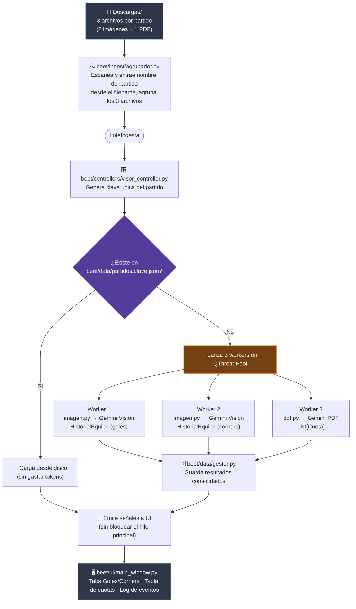

# Beet

Modelo de predicción y detección de apuestas de valor.

## Visión

Beet predice partidos de fútbol mediante simulación (no una fórmula cerrada de probabilidad): a partir de datos históricos y contexto del partido se simula el resultado, y de esa simulación surgen las probabilidades por mercado (1X2, doble oportunidad, DNB, goles, BTTS, corners). Esas probabilidades se comparan luego contra la cuota de la casa de apuestas para detectar value bets.

La fuente principal de datos es Adam Choi (capturas de pantalla + PDF de odds), procesadas con **Google Gemini** (visión + PDF nativo). El modelo está abierto a incorporar más fuentes/variables si eso mejora la precisión de la simulación.

El objetivo no es solo "encontrar cuotas mal calibradas" — es que la predicción en sí sea lo más precisa posible, y que el valor esperado surja de ahí. Cada predicción se puede verificar después contra el resultado real, y esa verificación retroalimenta el propio modelo (backtesting → calibración empírica → mejores predicciones).

Aunque hoy es una herramienta de análisis, la meta de fondo es que llegue a ser lo bastante confiable como para usarse con apuestas reales.

## Alcance

### Lo que Beet hace

- **Ingesta automática con IA**: escanea una carpeta, agrupa los 3 archivos por partido (2 imágenes + 1 PDF) y extrae datos estructurados mediante **Google Gemini** (visión para imágenes, PDF nativo para cuotas).
- **Pool de API Keys**: usa 2 claves de Gemini en paralelo para duplicar el throughput y evitar rate limits.
- **Datos persistentes**: guarda los resultados en `beet/data/partidos/*.json` para no gastar tokens en partidos ya procesados y alimentar el backtesting futuro.
- **Doble extracción**: procesa tanto los goles (Match Result) como los corners (Total Match Corners) de cada partido.
- **Modelado de dominio**: representa partidos, historiales de equipos, cuotas y mercados como objetos Python tipados.
- **Validación de datos**: detecta cuotas corruptas (≤1.00), nombres inconsistentes, secciones faltantes en PDF.
- **Visualización**: dashboard PyQt6 para validar que los parsers extraen correctamente antes de usarlos en el modelo.
- **Backtesting**: (futuro) comparar predicciones vs resultados reales para calibrar el modelo.

### Lo que Beet NO hace (por ahora)

- No coloca apuestas automáticamente ni se conecta a casas de apuestas.
- No es un tipster — comunica probabilidad y valor esperado, no certezas.
- No cubre todos los deportes — foco actual: fútbol.

## Estado actual

Arquitectura v3 implementada. El visor de validación de parsers está funcional con Gemini.

### Cambios recientes (v3.0)

- **Migración de OCR local a Google Gemini**: se eliminó Tesseract, OpenCV y pdfplumber. Ahora se usa `gemini-3.1-flash-lite` para visión y PDFs.
- **Pool de 2 API Keys**: procesamiento en paralelo con round-robin para evitar rate limits.
- **Doble imagen procesada**: se extraen tanto los goles (Match Result) como los corners (Total Match Corners) de cada partido.
- **Datos persistentes**: módulo `beet/data/` guarda resultados en `beet/data/partidos/*.json` para reutilización y backtesting.
- **Indicador visual**: los partidos ya procesados se muestran con "✓" verde en la lista.
- **Fix de Unicode**: workaround para rutas con tildes/ñ en Windows (Ceará, Goiás, São Paulo).
- **Escaneo automático**: al cargar una carpeta, se procesan todos los partidos en background automáticamente.

## Instalación

```bash
# 1. Clonar el repo
git clone https://github.com/NotName-K/Beet.git
cd Beet

# 2. Crear entorno virtual (recomendado)
python -m venv venv
# Windows:
venv\Scripts\activate

# 3. Instalar el paquete en modo editable
pip install -e ".[dev]"

# 4. Instalar Google Gemini SDK
pip install google-genai
```

**Nota**: Las API Keys de Gemini están hardcodeadas temporalmente en `beet/ingest/parsers/imagen.py` y `pdf.py`. Para producción, migrar a variables de entorno.

## Ejecución

| Forma | Comando / Acción |
| --- | --- |
| Desarrollo | `python beet-visor.py` |
| Como módulo | `python -m beet.ui` |
| Instalado | `beet-visor` |
| Windows (sin CMD) | Doble clic en `beet-visor.bat` |

## Estructura del proyecto

> ⚠️ **Nota sobre rutas**: los datos persistentes NO están en una carpeta `data/` a nivel de repo — viven en `beet/data/` (dentro del paquete Python). Es decir, la ruta completa es `beet/beet/data/partidos/` si estás parado en el directorio padre del repo clonado.

```
Beet/                          ← repo Git (raíz del clone)
 │
 ├── beet-visor.py              ← Entry point standalone
 │   Ejecuta el visor sin necesidad de instalar el paquete.
 │   Agrega la raíz del repo al sys.path e importa beet.ui.
 │
 ├── beet-visor.bat             ← Script Windows
 │   Doble clic. Ejecuta pythonw (sin ventana de consola).
 │   Si falla, reintenta con python + pausa para ver el error.
 │
 ├── pyproject.toml             ← Configuración del proyecto
 │   Define nombre, versión, dependencias, scripts de entrada,
 │   configuración de pytest, black y ruff.
 │
 ├── .gitignore                 ← Archivos ignorados por Git
 │   Excluye: __pycache__, venv/, beet/data/partidos/, *.csv
 │
 ├── README.md                  ← Este archivo
 │
 └── beet/                      ← Paquete Python principal (⚠️ data/ vive aquí adentro, no en la raíz)
     │
     ├── __init__.py            ← Marca el directorio como paquete
     │   Exporta __version__. Sin este archivo Python no reconoce
     │   el directorio como importable.
     │
     ├── core/                  ← 🧠 MODELOS DE DOMINIO
     │   │                      Clases puras de datos. Sin lógica de UI,
     │   │                      sin parsers, sin acceso a archivos.
     │   │
     │   ├── __init__.py
     │   │   Exporta: Partido, Cuota, HistorialEquipo,
     │   │   PartidoHistorico, NOMBRES_CANONICOS, normalizar_nombre
     │   │
     │   ├── partido.py
     │   │   Clase Partido. Representa un partido completo:
     │   │   liga, país, filtro_liga_aplicado, local, visitante,
     │   │   historial_local, historial_visitante, cuotas.
     │   │   Métodos: cuotas_validas(), cuotas_invalidas()
     │   │
     │   ├── cuota.py
     │   │   Clase Cuota (dataclass frozen). Mercado, valor, casa_origen,
     │   │   valida (bool). Validación automática: valor <= 1.00 → valida=False.
     │   │   Las cuotas inválidas van a revisión manual, nunca al cálculo de EV.
     │   │
     │   ├── historial_equipo.py
     │   │   Clases PartidoHistorico (frozen) e HistorialEquipo.
     │   │   PartidoHistorico: fecha, competición, rival, marcador (tuple),
     │   │   tarjetas_rojas, hit_mercado_resaltado (bool).
     │   │   HistorialEquipo: equipo (str), partidos (lista variable).
     │   │   Métodos: tasa_hit_mercado(), historial_corto (property).
     │   │
     │   └── normalizacion.py
     │       Tabla NOMBRES_CANONICOS para unificar nombres de equipos
     │       entre fuentes. Ej: "Viking FK" → "Viking", "Bodo Glimt" → "Bodø/Glimt".
     │       Función normalizar_nombre() consulta la tabla o devuelve el nombre limpio.
     │
     ├── ingest/                ← 📥 PIPELINE DE INGESTA
     │   │                      Extrae datos estructurados desde capturas
     │   │                      de pantalla (PNG) y PDFs de odds.
     │   │
     │   ├── __init__.py
     │   │   Exporta: agrupar_lote, parsear_imagen_historial,
     │   │   parsear_pdf_cuotas, LoteIngesta
     │   │
     │   ├── agrupador.py
     │   │   Función agrupar_lote(directorio) → Dict[str, LoteIngesta].
     │   │   Escanea archivos, extrae nombre de partido del filename
     │   │   (patrón: {local}_vs_{visitante}_predictions_{pais}_-_{liga}),
     │   │   agrupa los 3 archivos por partido.
     │   │   Clase LoteIngesta: local, visitante, pais, liga,
     │   │   rutas a img_corners, img_resultado, pdf.
     │   │   Tolerancia: guiones bajos opcionales, espacios, prefijos de screenshot.
     │   │
     │   └── parsers/
     │       │
     │       ├── __init__.py
     │       │   Exporta: ResultadoParseoImagen, ResultadoParseoPDF
     │       │
     │       ├── imagen.py
     │       │   Parser de imágenes con Google Gemini Vision.
     │       │   Usa gemini-3.1-flash-lite para extraer datos de capturas.
     │       │   Pool de 2 API Keys en paralelo (round-robin).
     │       │   Extrae: stat_type, highlight_market, filtro_liga,
     │       │   nombre de equipos, tabla de historial fila por fila.
     │       │   Detecta hit_mercado_resaltado por color de fondo
     │       │   (verde = hit, rojo = miss).
     │       │   Workaround de Unicode: copia archivo a ruta temporal ASCII.
     │       │   Clase ResultadoParseoImagen: contiene todos los datos extraídos
     │       │   + lista de errores.
     │       │
     │       └── pdf.py
     │           Parser de PDFs de cuotas con Google Gemini PDF nativo.
     │           Usa gemini-3.1-flash-lite para leer PDFs directamente.
     │           Pool de 2 API Keys en paralelo (round-robin).
     │           Extrae cuotas con casa_origen="bet365" (fuente Adam Choi).
     │           Workaround de Unicode: copia archivo a ruta temporal ASCII.
     │           Clase ResultadoParseoPDF: cuotas[], secciones_encontradas[], errores[].
     │
     ├── ui/                    ← 🖥️ INTERFAZ GRÁFICA (PyQt6)
     │   │                      Todo construido por código. Sin Qt Designer.
     │   │                      Muestra datos crudos del parser sin transformar.
     │   │
     │   ├── __init__.py
     │   │   Exporta: MainWindow
     │   │
     │   ├── __main__.py
     │   │   Entry point para "python -m beet.ui".
     │   │   Crea QApplication, instancia MainWindow, ejecuta loop.
     │   │
     │   ├── main_window.py
     │   │   Ventana principal. Layout:
     │   │   - Barra superior: botón "Abrir carpeta", ruta actual
     │   │   - Splitter: lista de partidos (izq) | tabs de resultados (der)
     │   │   - Tabs: Historial (Goles/Corners) | Cuotas (tabla)
     │   │   - Panel inferior: Log de eventos con timestamps
     │   │   Conecta señales del VisorController a slots de la UI.
     │   │   Carga automáticamente ~/Downloads al abrir.
     │   │
     │   └── widgets/
     │       │
     │       ├── __init__.py
     │       │   Exporta: LogPanel, PartidoList, HistorialTab, CuotasTab
     │       │
     │       ├── log_panel.py
     │       │   Panel de texto inferior. Read-only, scrollable.
     │       │   Métodos: log(mensaje), log_error(mensaje), clear().
     │       │   Colorea errores en rojo, info en gris.
     │       │
     │       ├── partido_list.py
     │       │   Lista de partidos detectados (QListWidget).
     │       │   Muestra "✓" verde para partidos ya procesados.
     │       │   Emite señal partido_seleccionado(clave, LoteIngesta)
     │       │   cuando el usuario hace click.
     │       │
     │       ├── historial_tab.py
     │       │   Pestaña de historial con tabs principales (Goles / Corners),
     │       │   cada uno con sub-tabs (Local / Visitante).
     │       │   Muestra tabla QTableWidget con columnas:
     │       │   Fecha, Competición, Rival, Marcador, Tarjetas Rojas, Hit Mercado.
     │       │   Las filas con hit se pintan de verde, sin hit de rojo.
     │       │   Muestra info de depuración: tipo, cantidad de registros, tiempo.
     │       │
     │       └── cuotas_tab.py
     │           Pestaña de cuotas. Tabla con columnas:
     │           Mercado, Casa, Valor, Válida.
     │           Cuotas inválidas (≤1.00) se pintan de rojo.
     │           Muestra info de depuración: total, inválidas, secciones, tiempo.
     │
     ├── controllers/           ← 🎛️ ORQUESTADOR
     │   │                      Conecta UI con ingest. Ejecuta parsers en background.
     │   │
     │   ├── __init__.py
     │   │   Exporta: VisorController
     │   │
     │   └── visor_controller.py
     │       Clase VisorController (QObject).
     │       Usa QThreadPool para ejecutar parsers sin congelar la UI.
     │       Clases internas: WorkerSignals, Worker (QRunnable).
     │       Señales: lotes_cargados, historial_goles_listo, historial_corners_listo,
     │       cuotas_listo, error_ocurrido, log_mensaje.
     │       Métodos: cargar_carpeta(), procesar_partido().
     │       Auto-escaneo: procesa todos los partidos al cargar carpeta.
     │       Verifica datos persistentes antes de llamar a Gemini.
     │       En errores: emite traceback completo para debug.
     │
     ├── data/                  ← 📊 DATOS PERSISTENTES (ruta completa: beet/data/)
     │   │                      Almacena resultados de parsers para análisis posterior.
     │   │
     │   ├── partidos/               ← JSON por partido procesado
     │   ├── __init__.py
     │   │   Exporta: guardar_partido, cargar_partido, listar_partidos,
     │   │   partido_procesado, eliminar_partido, exportar_a_csv,
     │   │   obtener_historial_equipo, obtener_todas_las_cuotas
     │   │
     │   ├── gestor.py
     │   │   Funciones de gestión de datos persistentes.
     │   │   Guarda/carga partidos en beet/data/partidos/{clave}.json.
     │   │   Exporta a CSV para análisis en Excel/pandas.
     │   │   Obtiene historial completo de equipos.
     │   │
     │   └── README.md
     │       Documentación del formato JSON y uso en análisis.
     │
     ├── services/              ← 🔮 RESERVADO PARA FUTURO
     │   │
     │   └── __init__.py
     │       Vacío por ahora. Aquí irá:
     │       - Motor de simulación de partidos
     │       - Cálculo de probabilidades por mercado
     │       - Detección de value bets (EV)
     │       - Calibración empírica con backtesting
     │
     └── tests/                 ← 🧪 TESTS UNITARIOS
         │
         ├── __init__.py
         │
         └── test_core.py
             Tests de Cuota (validación ≤1.00), PartidoHistorico,
             HistorialEquipo (tasa_hit, historial_corto), Partido (cuotas válidas/inválidas),
             Normalización (nombres canónicos).

## Flujo de datos



> El indicador **"✓" verde** en la lista de partidos (`beet/ui/widgets/partido_list.py`) marca los partidos que ya tienen JSON persistido y no necesitan volver a llamar a Gemini.

## Decisiones de diseño

### ¿Por qué Google Gemini en vez de OCR local?

- **Precisión superior**: Gemini entiende el layout, los colores (verde=hit, rojo=miss) y las tablas anidadas sin necesidad de preprocesamiento de imágenes ni ROI frágiles.
- **PDF nativo**: lee PDFs directamente, sin depender de pdfplumber que falla con tablas complejas.
- **Costo mínimo**: la capa gratuita de Gemini 3.1 Flash Lite es muy generosa.
- **Trade-off**: requiere conexión a internet y tiene rate limits (mitigado con pool de 2 API Keys).

### ¿Por qué 2 API Keys en paralelo?

- **Duplicar throughput**: cada clave tiene su propio límite de requests por minuto.
- **Round-robin**: los workers toman claves alternadamente para balancear la carga.
- **Thread-safe**: uso de `threading.Lock()` + `itertools.cycle` para concurrencia segura.

### ¿Por qué datos persistentes en JSON?

- **No gastar tokens**: si ya procesaste un partido, no lo reprocesas.
- **Backtesting futuro**: los datos históricos alimentarán el motor de simulación.
- **Exportable a CSV**: función `exportar_a_csv()` para análisis en Excel/pandas.
- **Legible**: JSON indentado, fácil de inspeccionar y debuggear.

### ¿Por qué PyQt6 y no web?

- Acceso local a archivos sin permisos CORS.
- Sin servidor: no requiere levantar backend ni navegador.
- Rendimiento: QThreadPool permite ejecutar parsers en paralelo sin bloquear UI.
- Empaquetado: se puede compilar a .exe con PyInstaller/Nuitka.

### ¿Por qué dataclasses frozen para el core?

- Inmutabilidad: los datos de dominio no deberían mutar accidentalmente.
- Hashables: se pueden usar como claves de dict o en sets.
- Claridad: el código describe exactamente qué campos tiene cada entidad.

### ¿Por qué workaround de Unicode para rutas?

- El SDK `google-genai` falla con rutas que contienen tildes/ñ (Ceará, São Paulo).
- Solución: copiar archivo a ruta temporal ASCII antes de subirlo a Gemini.
- Limpieza automática: el archivo temporal se borra inmediatamente después.

## Roadmap

| Fase | Estado | Descripción |
| --- | --- | --- |
| 1 | ✅ | Core de modelos (Partido, Cuota, Historial) |
| 2 | ✅ | Ingesta con Gemini Vision + PDF nativo |
| 3 | ✅ | Visor de validación de parsers (PyQt6) |
| 4 | ✅ | Datos persistentes en JSON |
| 5 | 🔲 | Motor de simulación (services/) |
| 6 | ⏳ | Calibración empírica + backtesting |
| 7 | 🔲 | Automatización de captura (selenium/playwright) |
| 8 | ⏳ | Migrar API Keys a variables de entorno |

## Licencia

MIT